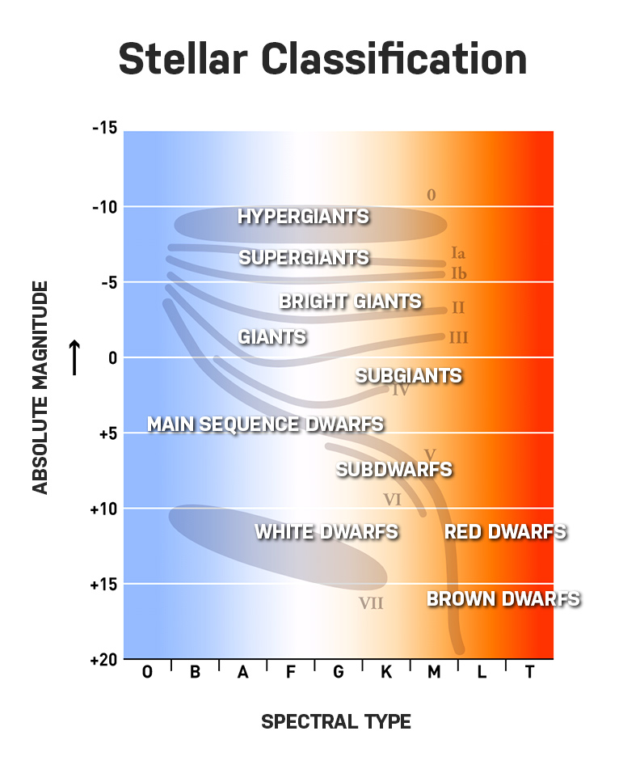

# Stellar Classification using Deep Learning techniques
A supervised classification task to predict star type based on Surface Temperature (in K), Luminosity (measured with respect to that of Sun), Radius (measured with respect to that of Sun), Absolute Magnitude (Visual), Star Color, & Spectral Class.

## Purpose:
The purpose of making the dataset is to prove that the stars follows a certain graph in the celestial Space, specifically called Hertzsprung-Russell Diagram or simply HR-Diagram, so that we can classify stars by plotting its features based on that graph.

#### The types of stars predicted at the end of training the model are:
1. Brown Dwarf (0)
2. Red Dwarf (1)
3. White Dwarf (2)
4. Main Sequence (3)
5. Supergiant (4)
6. Hypergiant (5)

## Dataset Source 
https://www.kaggle.com/deepu1109/star-dataset

## Data Collection and Preparation techniques:
The dataset is created based on several equations in astrophysics. They are given below:

1. [Stefan-Boltzmann's law](http://hyperphysics.phy-astr.gsu.edu/hbase/thermo/stefan.html) of Black body radiation (To find the luminosity of a star)
2. [Wienn's Displacement law](http://hosting.astro.cornell.edu/academics/courses/astro201/wiens_law.htm) (for finding surface temperature of a star using wavelength)
3. [Absolute magnitude relation](http://astrosun2.astro.cornell.edu/academics/courses/astro201/mag_absolute.htm)
4. Radius of a star using parallax.
5. The dataset took 3 weeks to collect for 240 stars which are mostly collected from web.
6. The missing data were manually calculated using those equations of astrophysics given above.

## Inspiration
Interest in Astronomy & Stellar Evolution

